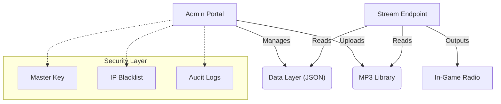
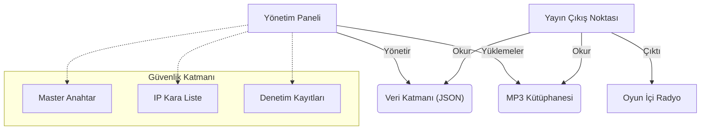

# VELTHYRA | Administrative Radio Portal

---

## 🇬🇧 [EN] ENGLISH DOCUMENTATION

### System Overview
Velthyra is a lightweight, centralized administrative interface designed for radio broadcasting and content management. Its zero-database JSON architecture ensures high performance and portability.

### System Architecture

### Key Features
| Feature | Description |
| :--- | :--- |
| **Globalization** | Integrated 6-language engine (EN, TR, FR, BG, DE, RU). |
| **Security** | SHA-512 Master Key authentication and IP-level firewall. |
| **Telemetry** | Real-time tracking of track offsets and server synchronization. |
| **Data Layer** | Zero-DB JSON architecture for maximum portability. |

### Deployment Guide
1. **Upload**: Deploy all source files to a PHP 8.0+ web server environment.
2. **Permissions**: Ensure `./data/` and `./admin/uploads/` are writable (CHMOD 775).
3. **Configuration**: Update the critical files listed below.

### Critical Configuration
| Path | Variable | Action |
| :--- | :--- | :--- |
| `functions/auth.php` | `VELORIAN_MASTER_KEY` | Replace `CHANGEMEBUDDY` with a secure passphrase. |
| `includes/config.php` | `VELORIAN_SALT` | Replace `CHANGEMEBUDDY` with a unique security salt. |
| `data/users.json` | `admin / admin` | Update your admin credentials upon first login. |

### XMR Radio Integration
Use the `stream.php` endpoint for in-game radio system integration.
**Link**: `http://yourdomain.com/stream.php`

---

## 🇹🇷 [TR] TÜRKÇE DOKÜMANTASYON

### Sistem Özeti
Velthyra, radyo yayını ve içerik yönetimi için tasarlanmış merkezi bir idari arayüzdür. Veritabanı gerektirmeyen (JSON tabanlı) mimarisi sayesinde hızlı kurulum ve taşınabilir bir yapı sunar.

### Sistem Mimarisi

### Temel Özellikler
| Özellik | Açıklama |
| :--- | :--- |
| **Küreselleşme** | Yerleşik 6-dil desteği (EN, TR, FR, BG, DE, RU). |
| **Güvenlik** | SHA-512 Master Key doğrulaması ve IP tabanlı erişim kontrolü. |
| **Telemetri** | Parça ilerlemesi ve sunucu senkronizasyonunun anlık takibi. |
| **Veri Katmanı** | Hızlı ve taşınabilir JSON tabanlı mimari. |

### Kurulum Rehberi
1. **Yükleme**: Tüm dosyaları PHP 8.0+ destekleyen web sunucunuza yükleyin.
2. **İzinler**: `./data/` ve `./admin/uploads/` klasörlerinin yazılabilir (CHMOD 775) olduğundan emin olun.
3. **Konfigürasyon**: Aşağıda belirtilen kritik dosyaları güncelleyin.

### Kritik Konfigürasyon (Değiştirilecek Yerler)
| Dosya Yolu | Değişken | İşlem |
| :--- | :--- | :--- |
| `functions/auth.php` | `VELORIAN_MASTER_KEY` | `CHANGEMEBUDDY` kısmına güvenli bir anahtar şifre yazın. |
| `includes/config.php` | `VELORIAN_SALT` | `CHANGEMEBUDDY` kısmına benzersiz bir güvenlik tuzu yazın. |
| `data/users.json` | `admin / admin` | İlk girişten sonra yönetici şifrenizi mutlaka güncelleyin. |

### XMR Radyo Entegrasyonu
Oyun içi radyo sistemlerine entegre etmek için `stream.php` dosyasını kullanın.
**Link**: `http://site-adresiniz.com/stream.php`

---
**VELTHYRA ENTERPRISE SOLUTIONS**  
*The Structure of Sound | Ref: VLT-MAN-2026*
